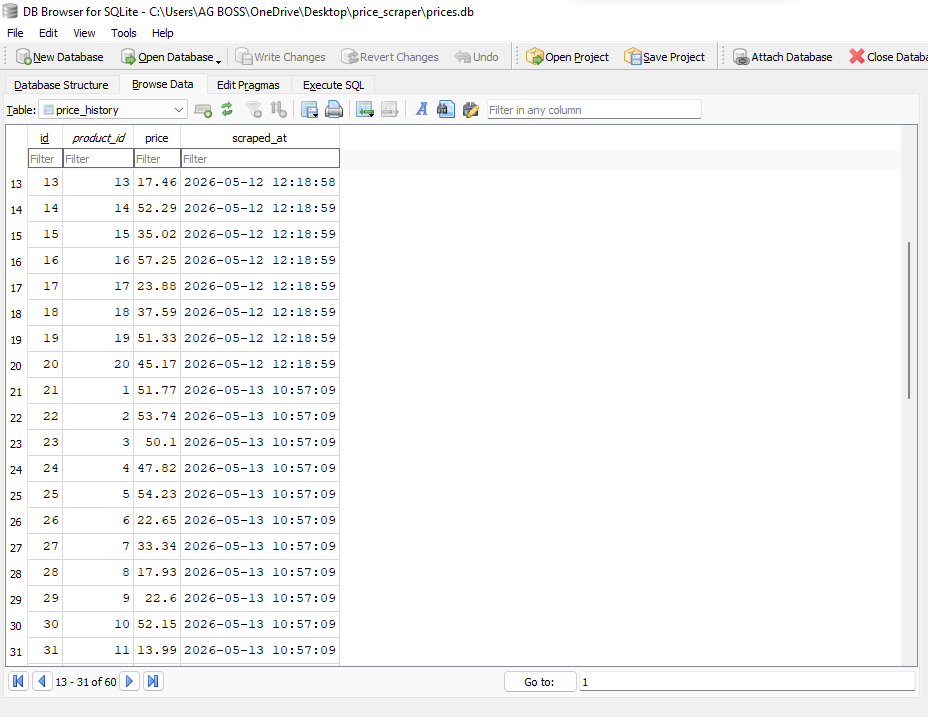

# Price Scraper

Scrapes book prices from books.toscrape.com, stores them in a local SQLite database, and emails you when a price drops or hits a target you set.

Built with Python, BeautifulSoup, SQLite, and smtplib.

---

## Setup

```bash
pip install -r requirements.txt
```

Copy `.env.example` to `.env` and fill in your Gmail credentials:
```
ALERT_EMAIL=you@gmail.com
ALERT_PASSWORD=your_app_password
ALERT_TO=you@gmail.com
```

> Gmail App Password: Google Account → Security → 2-Step Verification → App Passwords. Generate one and paste it above.

---

## Usage

```bash
python main.py --once        # scrape once and exit
python main.py               # scrape now, then every hour automatically
python main.py --dashboard   # show everything in the database
```

To set a price target for a book, open a Python shell in the project folder:
```bash
python
>>> from main import set_target
>>> set_target("Sapiens", 10.00)
>>> exit()
```

---

## How it works

Each run scrapes the site, saves prices with a timestamp, then compares to the previous snapshot. If a price dropped 10%+ or hit your target, it sends you an email.

The database grows one row per book per run — that's your price history.

---

## Preview



## Files

```
main.py          orchestrates everything + runs the scheduler
scraper.py       visits the site and pulls titles + prices
database.py      saves and queries prices.db
alerts.py        sends email alerts via Gmail
requirements.txt libraries to install
.env.example     template for your credentials
assets           shows the screenshot of the price history
```
